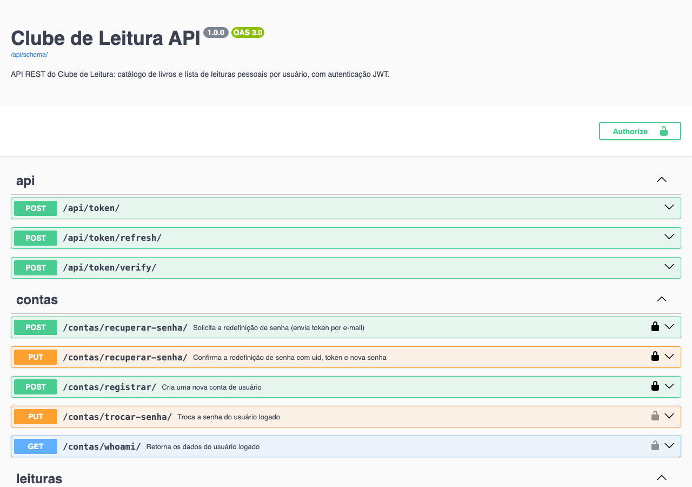
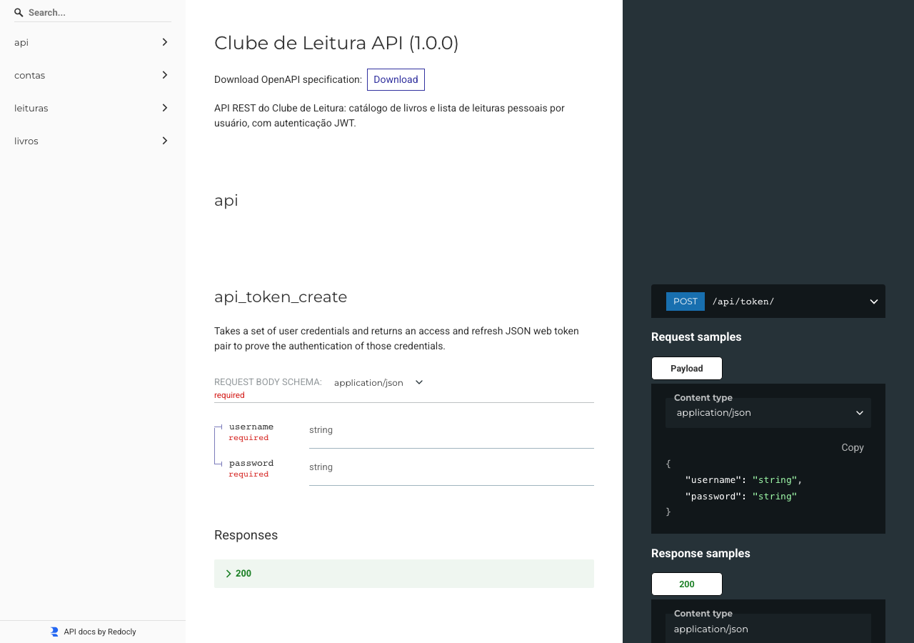
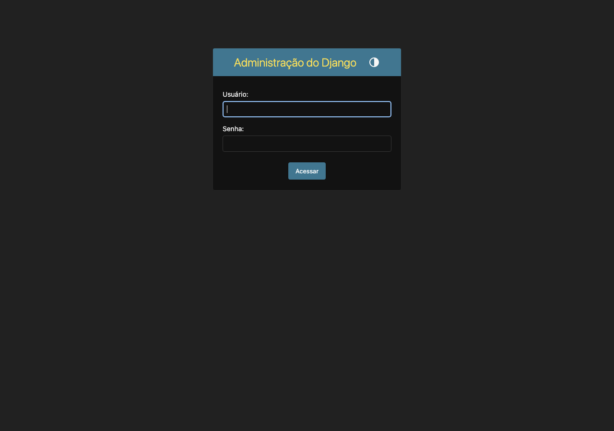

# Clube de Leitura - Backend

API REST do **Clube de Leitura**, trabalho 2 da disciplina INF1407 (Programação para
Web - PUC-Rio). O backend é uma API JSON feita com **Django REST Framework**, com
autenticação **JWT** e documentação **Swagger/OpenAPI**. O frontend é um projeto
separado (site estático em HTML/CSS/TypeScript) que consome esta API.

**Autor:** Guilherme Riechert Senko (matrícula 2011478)

- Repositório do frontend: https://github.com/guilhermesenko/frontend_t2

## Tecnologias

- Python 3.12 / Django + Django REST Framework
- `djangorestframework-simplejwt` - autenticação JWT (access + refresh)
- `drf-spectacular` - documentação Swagger / OpenAPI
- `django-cors-headers` - CORS (o frontend roda em outra origem)
- PostgreSQL (produção, via Docker) / SQLite (desenvolvimento)
- gunicorn + whitenoise (servir em container)

## Domínio

- **Livro** - catálogo de livros (CRUD restrito a administradores; leitura pública).
- **Leitura** - lista de leituras pessoal de cada usuário (status *Quero Ler / Lendo /
  Li*, nota de 1 a 5 e resenha), protegida por usuário.

## Como rodar localmente

```bash
python3 -m venv .venv
source .venv/bin/activate            # Windows: .venv\Scripts\activate
pip install -r requirements.txt

cd ClubeLeitura
python manage.py migrate
python manage.py createsuperuser      # opcional, para acessar o /admin
python manage.py runserver
```

A API sobe em `http://localhost:8000/`. Sem a variável de ambiente `DB_HOST` o
projeto usa SQLite automaticamente.

## Rodando a imagem publicada no Docker Hub

A imagem do backend está publicada em
[guilhermesenko/clubeleitura_backend_t2](https://hub.docker.com/r/guilhermesenko/clubeleitura_backend_t2).
Para baixar e executar (sobe com SQLite, faz as migrações e inicia o servidor):

```bash
docker pull guilhermesenko/clubeleitura_backend_t2:latest
docker run --name clube_back -p 8000:8000 guilhermesenko/clubeleitura_backend_t2:latest
```

A API fica em `http://localhost:8000/` (Swagger em `/swagger/`).

Para testar as funcionalidades de administrador (cadastro de livros), crie um
superusuário no container em execução:

```bash
docker exec -it clube_back python manage.py createsuperuser
```

## Rodando com Docker Compose (Django + PostgreSQL)

A partir do código-fonte, este comando sobe o PostgreSQL e o backend juntos:

```bash
docker compose up --build
```

Sobe o PostgreSQL e o backend em `http://localhost:8000/`.

## Documentação da API

- Swagger UI: `http://localhost:8000/swagger/`
- ReDoc: `http://localhost:8000/redoc/`
- Schema OpenAPI: `http://localhost:8000/api/schema/`

## Autenticação (JWT)

| Método | Rota | Descrição |
| --- | --- | --- |
| POST | `/api/token/` | login - retorna `access` e `refresh` |
| POST | `/api/token/refresh/` | renova o `access` |
| POST | `/api/token/verify/` | verifica um token |

Envie o token nas requisições protegidas no cabeçalho
`Authorization: Bearer <access token>`.

## Endpoints da aplicação

### Livros (catálogo)
| Método | Rota | Permissão |
| --- | --- | --- |
| GET | `/livros/` | pública |
| POST | `/livros/` | admin (is_staff) |
| GET | `/livros/<id>/` | pública |
| PUT | `/livros/<id>/` | admin |
| DELETE | `/livros/<id>/` | admin |

### Leituras (lista pessoal, sempre do usuário logado)
| Método | Rota | Permissão |
| --- | --- | --- |
| GET | `/leituras/` | autenticado |
| POST | `/leituras/` | autenticado |
| GET | `/leituras/<id>/` | autenticado (dono) |
| PUT | `/leituras/<id>/` | autenticado (dono) |
| DELETE | `/leituras/<id>/` | autenticado (dono) |

### Contas
| Método | Rota | Descrição |
| --- | --- | --- |
| POST | `/contas/registrar/` | cria uma conta |
| GET | `/contas/whoami/` | dados do usuário logado |
| PUT | `/contas/trocar-senha/` | troca a senha (autenticado) |
| POST | `/contas/recuperar-senha/` | solicita token de redefinição |
| PUT | `/contas/recuperar-senha/` | redefine a senha com uid + token |

Em desenvolvimento, a redefinição de senha usa o `EMAIL_BACKEND` de console: o uid e
o token aparecem no log do servidor.

## Telas

Documentação Swagger da API:



Documentação ReDoc:



Painel administrativo do Django:



## O que funcionou e o que não funcionou

Tudo o que foi proposto foi testado e está funcionando:

- CRUD completo de livros (leitura pública, escrita restrita a administradores).
- CRUD completo de leituras, sempre limitado ao usuário logado.
- Autenticação JWT (login, refresh e verify) e endpoint protegido (`IsAuthenticated`).
- Registro de usuário, troca de senha e redefinição de senha por token.
- Controle de acesso por papel (administrador x usuário comum).
- Documentação Swagger e ReDoc de todos os endpoints.
- Publicação da imagem no Docker Hub.

Não há funcionalidades com problemas conhecidos. Em desenvolvimento, a redefinição de
senha usa o backend de e-mail de console: o uid e o token aparecem no log do servidor
(em produção, bastaria configurar um servidor SMTP real).
